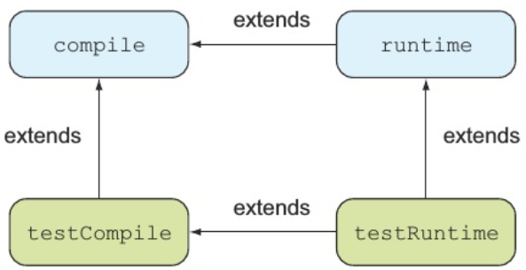

# my-action-git

此处列出我关于 Gradle 的学习实践。

# Code Snippet
- [code snippet](code-snippet.md)

# 资源
- [配置子项目](http://wiki.jikexueyuan.com/project/gradleIn-action/configure-subproject.html)
- [Meihai/gradle-multi-project](https://github.com/Meihai/gradle-multi-project)
- [someok/gradle-multi-project-example](https://github.com/someok/gradle-multi-project-example/blob/master/readme.md)
- [bmuschko/gradle-in-action-source](https://github.com/bmuschko/gradle-in-action-source)
- [davenkin/gradle-learning](https://github.com/davenkin/gradle-learning)
- [Gradle详解+Groovy](https://blog.csdn.net/u014761700/article/details/51867939)
- [使用Gradle docker插件和registry打包应用| SpringBoot实践](https://www.jianshu.com/p/5b5c034e1da9)

# HandBook

#### 设置版本号
```groovy
version = 0.1
```

#### 设置JDK源码级别
```groovy
sourceCompatibility = 1.8
```

#### 设置Main Class
```groovy
jar {
    manifest {
        attributes 'Main-Class': 'com.manning.gia.todo.ToDoApp'
    }
 }
```

#### 设置项目布局
```groovy
sourceSets {
    main {
        java {
            srcDirs = ['src']
        }
    }

    test {
        java {
           srcDirs = ['test']
       }
    }
}
```

#### 设置项目输出目录
```groovy
buildDir = 'out'
```

## 指定仓库
#### 添加Maven仓库
```groovy
repositories {
     mavenCentral()
}
```

#### 添加本地仓库
```groovy
repositories {
     mavenLocal()
}
```

#### 添加自定义Maven仓库
```groovy
repositories {
    mavenCentral()
    maven {
        name 'Custom Maven Repository',
        url 'http://repository.forge.cloudbees.com/release/')
    }
}
```

## 定义依赖
```groovy
dependencies {
      compile group: 'org.apache.commons', name: 'commons-lang3', version: '3.1'
}
```

#### 排除传递依赖
```groovy
dependencies {
      cargo('org.codehaus.cargo:cargo-ant:1.3.1') {
          exclude group: 'xml-apis', module: 'xml-apis'
      } 
      cargo 'xml-apis:xml-apis:2.0.2'
}
```

#### 排除所有的传递依赖
```groovy
dependencies {
     cargo('org.codehaus.cargo:cargo-ant:1.3.1') {
          transitive = false
     } 
    // 选择性的声明一些需要的库
}
```

#### 动态依赖最新的版本
```groovy
dependencies {
       //依赖最新的1.x版本
       cargo 'org.codehaus.cargo:cargo-ant:1.+'
}
```

#### 常用命令
新建一个build.gradle文件
```
gradle projects
gradle build
gradle dependencies
gradle –q dependencies
gradle :model:build
gralde :repository:build -a
gradle :repository:test
gradle :repository:test –i
```

## 项目模块化
添加设置文件 `settings.gradle`
```groovy
include 'todo-model', 'todo-repository', 'todo-web'
```

#### 设置根项目的名字
```groovy
rootProject.name = 'todo'
```

#### 设置自定义的构建脚本名称
```groovy
rootProject.children.each {
      it.buildFileName = it.name + '.gradle' - 'todo-'
}
```

#### 声明项目依赖
```groovy
project(':repository') {
    //...
    dependencies {
        //声明编译期依赖项目model
        compile project(':model')
    }
}
```

#### 定义共同的行为
```groovy
allprojects {
     group = 'com.manning.gia'
     version = '0.1'
}
subprojects {
     apply plugin: 'java'
} 
project(':repository') {
    dependencies {
         compile project(':model')
    }
}
project(':web') {
    apply plugin: 'war'
    apply plugin: 'jetty'
    repositories {
        mavenCentral()
    }
   dependencies {
       compile project(':repository')
       providedCompile 'javax.servlet:servlet-api:2.5'
       runtime 'javax.servlet:jstl:1.1.2'
   }
}
```

#### 拆分项目文件
在每个子项目的目录下创建一个build.gradle文件

## 测试
```groovy
dependencies {
    testCompile 'junit:junit:4.11'
}
```



#### 自动测试检查
- 任何继承自junit.framework.TestCase 或groovy.util.GroovyTestCase的类
- 任何被@RunWith注解的子类
- 任何至少包含一个被@Test注解的类